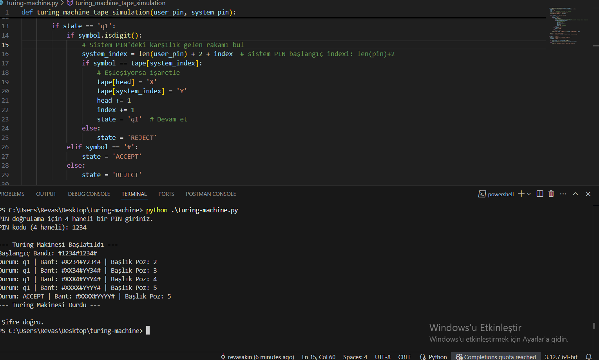
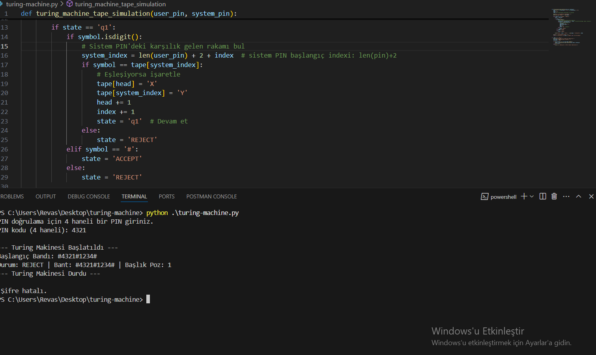
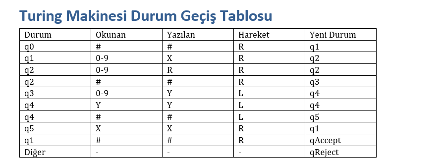

#  Turing Makinesi ile PIN Doğrulama Simülasyonu

Bu proje, Turing makinesi'ni gerçek haya ile ilişkilendirmek için yapılmıştır. Kullanıcıdan alınan 4 haneli bir PIN kodu, sistemde kayıtlı PIN ile karşılaştırılır ve eşleşme durumuna göre kabul (ACCEPT) veya reddetme (REJECT) kararı verilir.

---

##  Amaç

Bankamatik (ATM) gibi sistemlerde kullanılan PIN doğrulama mantığını, Turing makinesi modeli ile temsil etmek ve bir yazılım projesi olarak simüle etmektir.


## Youtube Videosu
https://www.youtube.com/watch?v=Bpg9_O-4FB8&ab_channel=revasak%C4%B1n

## Uygulama görselleri
<p align="center">


</p>

## Turing Makinesi Durum Geçiş Tablosu
<p align="center">

</p>


## PIN kontrol bandı şu yapıda oluşturulur:

```bash
   #1234#1234#
   ```
-İlk 1234: Kullanıcı PIN’i

-Ortadaki #: Ayraç

-İkinci 1234: Sistem PIN’i

-Son #: Sonlandırıcı

##  Projeyi Çalıştırmak

1. Proje dosyasını indirin veya klonlayın:
   ```bash
   git clone https://github.com/rewas72/turing-machine-python
   cd turing-machine
   python turing-machine.py

## Kullanıcı Girdisi

###  Doğru PIN:
    ```bash
    Giriş: 1234
    Sabit PIN: 1234
    Sonuç:  Şifre doğru.
    ```
### Yanlış PIN:

```bash
    Giriş: 1234
    Sabit PIN: 4321
    Sonuç:  Şifre yanlış.
    


    


